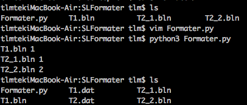

SLFormater
==========
##简介
本Python脚本是用来将Surfer内做出的以bln为后缀的散点文件转化为Landmark中Z-map所能识别的格式，十分欢迎各位同我一起改进这个脚本。

##使用说明
1. 将Formater.py脚本与需要处理的文件置于同一文件夹下
2. 确认需要处理的文件以T1.bln、T2_1.bln、T2_2.bln格式命名
3. 编辑Formater.py文件，编辑列表Zu=[]，例如Zu=["T1","T2"]
4. 运行该脚本即可，将在屏幕上输出处理的文件，最终生成的文件为T1.dat、T2.dat

##Example

